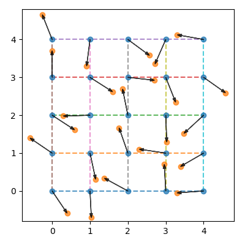
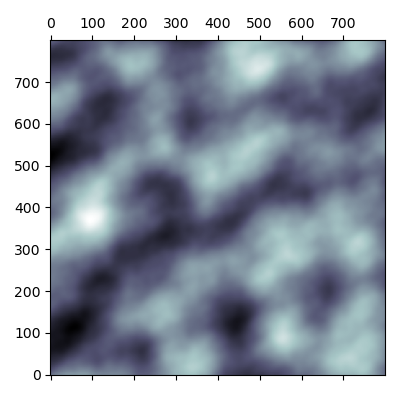

# pyrlin

`grid.py`           | `noise.py`
:------------------:|:-------------------:
 | 

Needed things
---
 * [Nix](https://nixos.org/nix/)

Quick start
---
```
$ nix-shell
[nix-shell:path/to/pyrlin]$ python src/main.py 0 3 5 200 6 10 0.2
[nix-shell:path/to/pyrlin]$ open out/grid.png
[nix-shell:path/to/pyrlin]$ open out/noise.png
```

Helpful links
---
* https://en.wikipedia.org/wiki/Perlin_noise
* https://longwelwind.net/2017/02/09/perlin-noise.html
* https://rmarcus.info/blog/2018/03/04/perlin-noise.html
