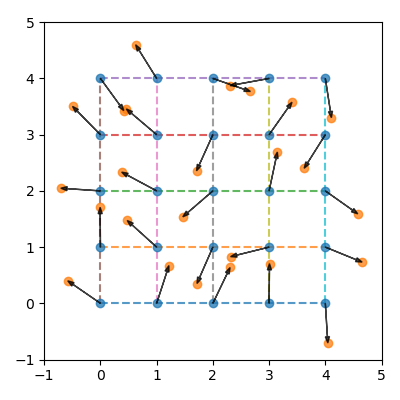

# pyrlin

`grid.py`           | `noise.py`
:------------------:|:-------------------:
 | 

Needed things
---
 * [Nix](https://nixos.org/nix/)

Quick start
---
```
$ nix-shell
[nix-shell:path/to/pyrlin]$ python src/main.py 0 5 5 100 4 0.3 6 6 0.2
[nix-shell:path/to/pyrlin]$ open out/grid.png
[nix-shell:path/to/pyrlin]$ open out/noise.png
```

Args
---
```
main.py \
    <seed: int> \           # random seed
    <n_col: uint> \         # number of grid columns
    <n_row: uint> \         # number of grid rows
    <resolution: uint> \    # interpolation resolution
    <octaves: uint> \       # number of octaves
    <persistence: float> \  # octave rate of decay
    <plot_x: uint> \        # width of plots
    <plot_y: uint> \        # height of plots
    <grid_plot_pad: float>  # grid plot axis padding
```

Helpful links
---
* https://en.wikipedia.org/wiki/Perlin_noise
* https://longwelwind.net/2017/02/09/perlin-noise.html
* https://rmarcus.info/blog/2018/03/04/perlin-noise.html
* https://flafla2.github.io/2014/08/09/perlinnoise.html
