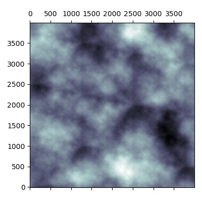

# pyrlin

| `grid`              | `noise`              | `map`              |
:--------------------:|:--------------------:|:------------------:|
|  |  |  |

Needed things
---
 * [Nix](https://nixos.org/nix/)

Quick start
---
```
$ nix-shell
[nix-shell:path/to/pyrlin]$ python src/main.py 99 5 5 1000 6 0.465 4 4 0.25
[nix-shell:path/to/pyrlin]$ open out/grid.png
[nix-shell:path/to/pyrlin]$ open out/noise.png
[nix-shell:path/to/pyrlin]$ open out/map.png
```

Args
---
```
#                           . DESCRIPTION               . BOUNDS
main.py \
    <seed: int> \           # random seed               [  ?, ?]
    <n_col: int> \          # number of grid columns    [  2, ?]
    <n_row: int> \          # number of grid rows       [  2, ?]
    <resolution: int> \     # interpolation resolution  [  2, ?]
    <octaves: int> \        # number of octaves         [  1, ?]
    <persistence: float> \  # octave rate of decay      [0.0, ?]
    <plot_x: int> \         # width of plots            [  1, ?]
    <plot_y: int> \         # height of plots           [  1, ?]
    <grid_plot_pad: float>  # grid plot axis padding    [0.0, ?]
```

Helpful links
---
* https://en.wikipedia.org/wiki/Perlin_noise
* https://longwelwind.net/2017/02/09/perlin-noise.html
* https://rmarcus.info/blog/2018/03/04/perlin-noise.html
* https://flafla2.github.io/2014/08/09/perlinnoise.html
